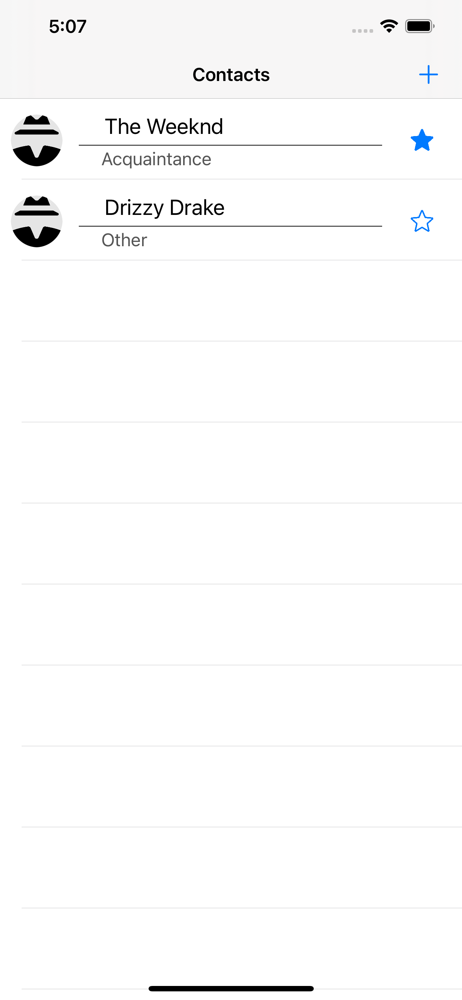
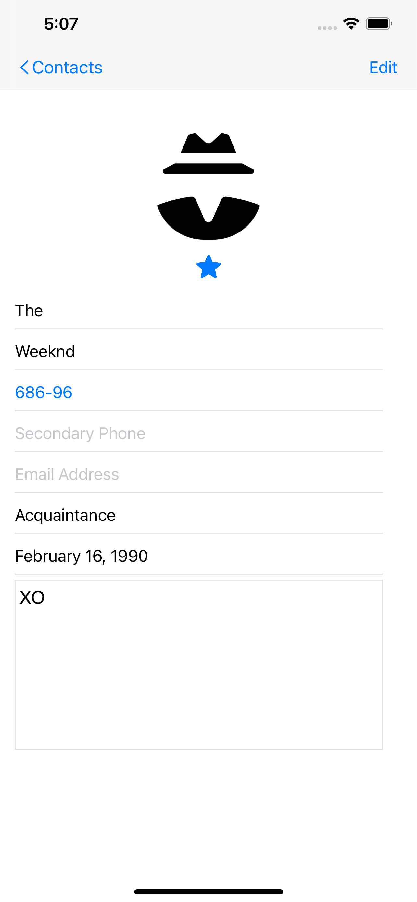

# My Contacts

My Contacts is a simple iOS app that allows a user to keep track of their contacts on their local iOS device. Keep track of contacts' photos, label your relationship to them, and even jot some notes down about them!

## Running the App

My Contacts can be opened in Xcode and deployed to an iOS device just like any other app. Just open the .xcodeproj and build to your device.

## Screenshots

